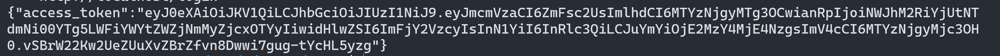

To get more familiar with the microservice, we can try different API endpoints to do some basic tasks first.

Our microservice currently provide these API endpoints:
> POST /login - login the service 
>
> GET /eats/[store_id] - get the menu, store name, opening status of a restaurant
>
> POST /eats/[store_id]/menu - update the menu of a restaurant
>
> POST /eats/order - create a order
>
> GET /eats/order/[order_id] - check the order
>
> POST /eats/order/[order_id]/status - update the order status

All the microservice requires authentication, and we need to login to get the JWT (JSON Web Tokens) by using the `/login` endpoints.

`curl -H "Content-Type: application/json" --request POST -d '{ "username": "test", "password": "test" }' http://localhost:8080/login`{{execute T1}}

Output:

It will return a JWT Token. The token will be used in the other endpoints. We can save the token into a variable.

`jwt_var=<token inside the result>`

**Important: You need to copy and paste the JWT here manually**

## To get the restaurant information with id 00001
`curl -H "Authorization: Bearer $jwt_var" --request GET http://localhost:8080/eats/00001`{{execute T1}}

## To add a new menu (Lunch Set D) on the store 00001
`curl -H "Authorization: Bearer $jwt_var" -H "Content-Type: application/json" -d '{
      "menu_id": "D",
      "name": "Set Lunch D",
      "price": "150"
  }' --request POST http://localhost:8080/eats/00001/menu`{{execute T1}}

## To add a new order
`curl -H "Authorization: Bearer $jwt_var" -H "Content-Type: application/json" -d '{
      "store_id": "00001",
      "details": [
          {
              "menu_id": "A",
              "count": 1
          }
      ]
  }' --request POST http://localhost:8080/eats/order`{{execute T1}}

Expected Output:

It will return an order id, save it into the `oid` variable for the next endpoint.

`oid=<order-id>`

## To get the detail of an order
`curl -H "Authorization: Bearer $jwt_var" --request GET http://localhost:8080/eats/order/$oid`{{execute T1}}

Expected Output:

## To change the order status
`curl -H "Authorization: Bearer $jwt_var" -H "Content-Type: application/json" -d '{
    "status": "ACCEPTED"
}' --request POST http://localhost:8080/eats/order/$oid/status
`{{execute T1}}