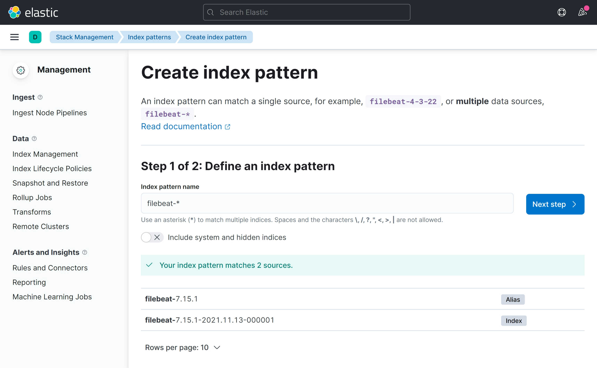
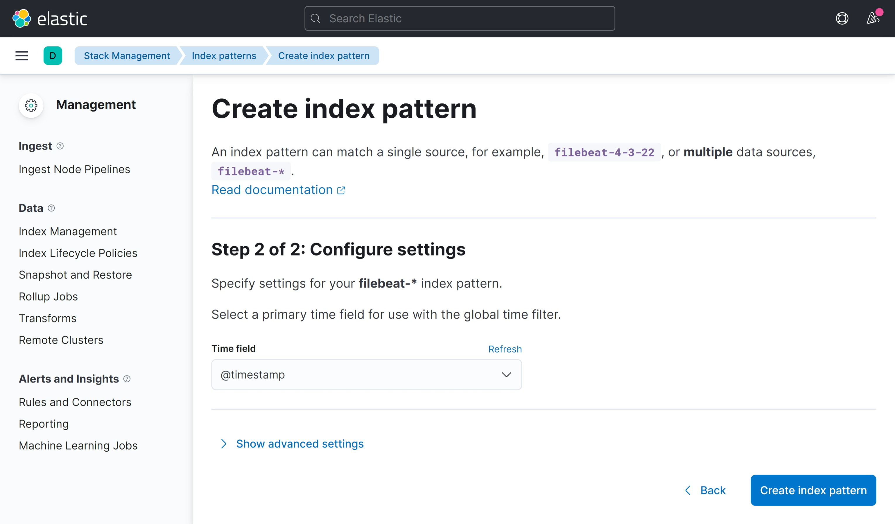
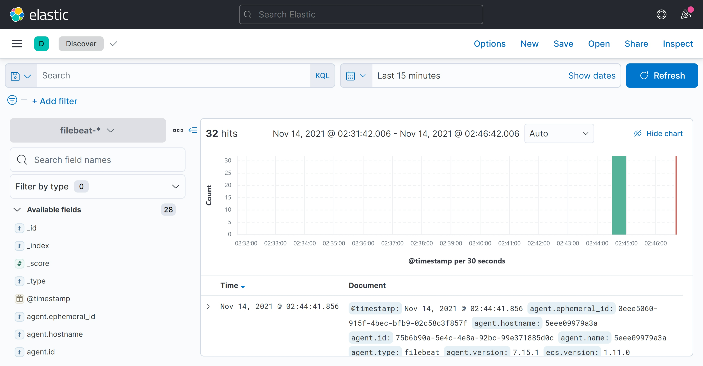

The EFK Stack is useful for the logs analysis, monitoring, and distributed tracing.

## To access the Kibana
https://[[HOST_SUBDOMAIN]]-5601-[[KATACODA_HOST]].environments.katacoda.com

## Set up the Index Pattern

Input `filebeat-*` as the pattern

Select `@timestamp` as Timestamp field

## Go to Discover to analyize data

