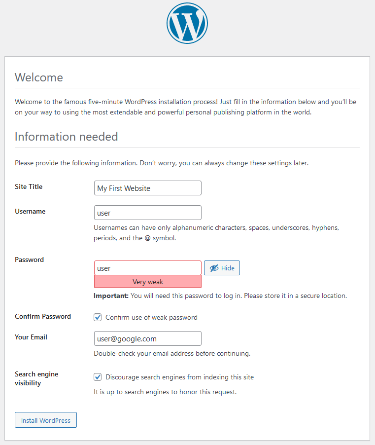
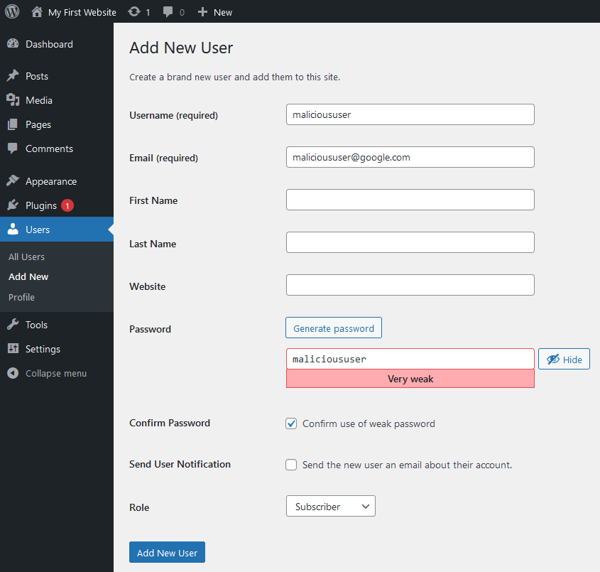
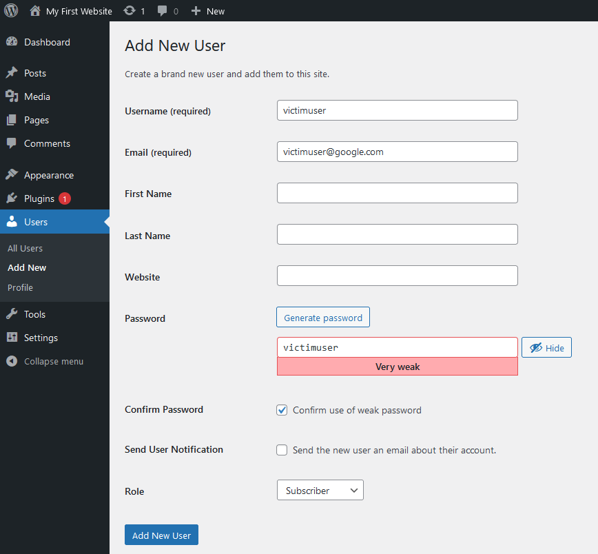
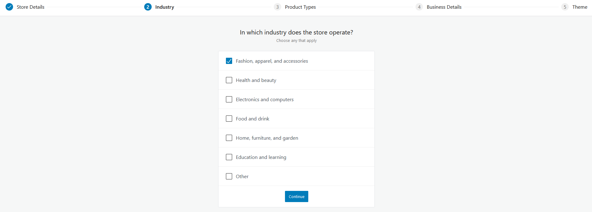
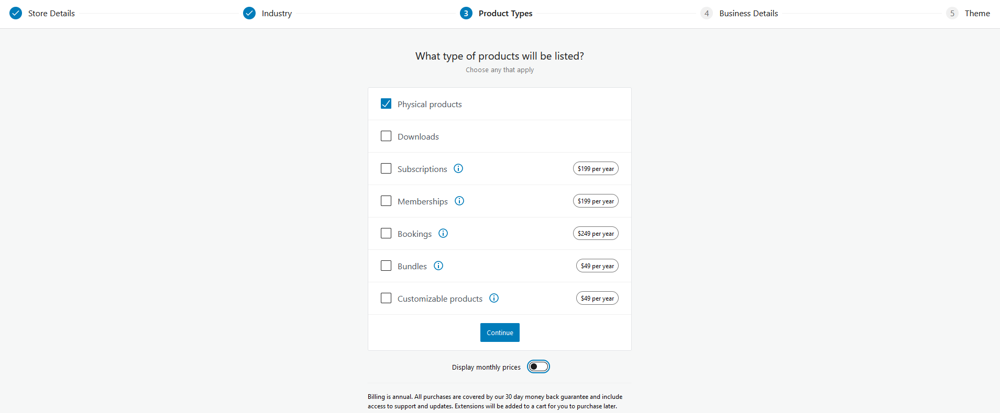
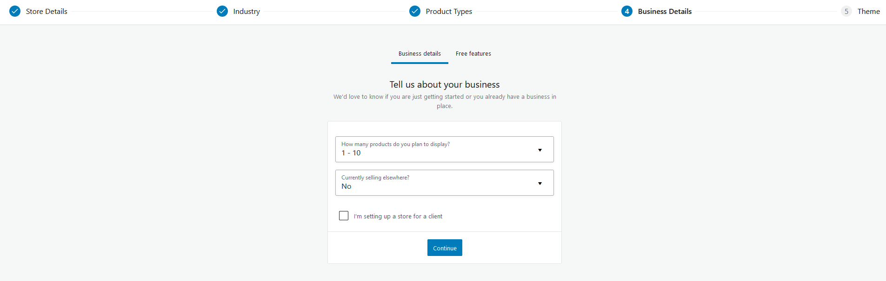
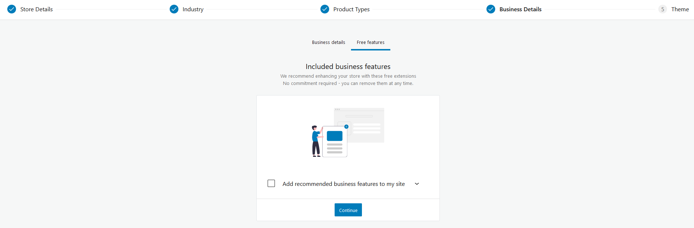
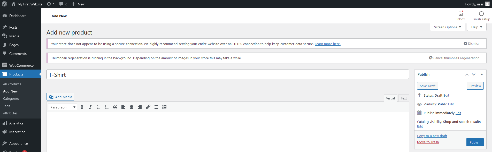

# Heading for Step 2

Now we can access the Wordpress in port 20080 by accessing the following link:
https://[[HOST_SUBDOMAIN]]-20080-[[KATACODA_HOST]].environments.katacoda.com

1.	Wordpress Setup:
We first set up the wordpress account with username `user` and password `user`. Other details can be filled in your interest.

2.	User account creation:
Then we go to login with the `user` credentials. 
Choose `Users -> Add New` from the left panel.
We setup another user with username `malicioususer`, password `malicioususer` and role `subscriber`.

We also setup another user with username `victimuser`, password `victimuser` and role `subscriber`.

These accounts will be used later for demo use.

3. WooCommerce plugin setup:
Choose `Plugins -> Add New` from the left panel.
Search `WooCommerce`, and select `Install Now` and `Activate` after installation.
Then it will be redirected to the WooCommerce setup page.
Enter other details can be filled in your interest, except those specified below:
Choose `Fashion, apparel, and accessories` in Step 2.

Choose `Physical Products` in Step 3.

Choose `1-10` in `How many products do you plan to display?`, `No` in `Currently selling elsewhere?`, 
and uncheck `I'm setting up a store for a client` in Step 4.

Uncheck `Add recommended business features to my site` in Step 5.

Press `Continue'.
Select `Storefront` and press `Choose`.
In left panel, choose `WooCommerce -> Home`.
Choose `Add my products`, `Start with a template`, `Physical product`.
Enter the product name `T-Shirt`.

Now, we finished the setup of Wordpress part.