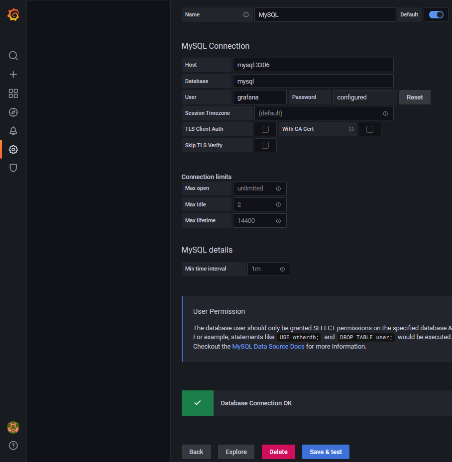

# Heading for Step 3

Now we can access the Grafana in port 3000 by accessing the following link:
https://[[HOST_SUBDOMAIN]]-3000-[[KATACODA_HOST]].environments.katacoda.com

1. Grafana setup:
We can login with username `admin` and password `admin`.
Skip the password modification.
In the left panel, select `Configuraion -> Data sources`.
Press `Add data source`, search `MYSQL`.
Enter `mysql:3306` as `Host`, `mysql` as `Database`, 
`grafana` as `user`, `grafana` as password.
Press `Save & test`, it should shows `Database Connection OK` if connected successfully.

