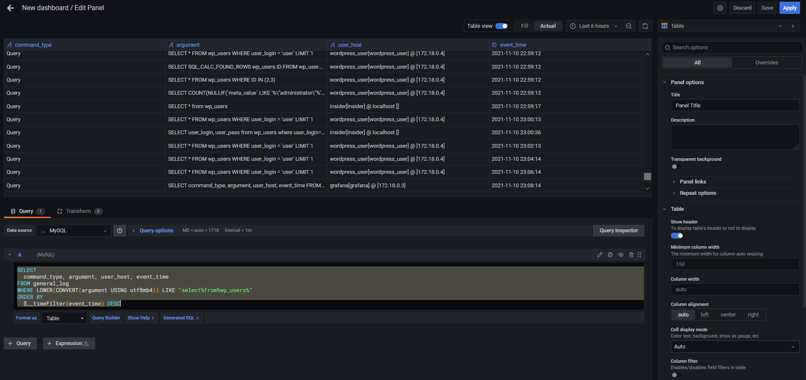
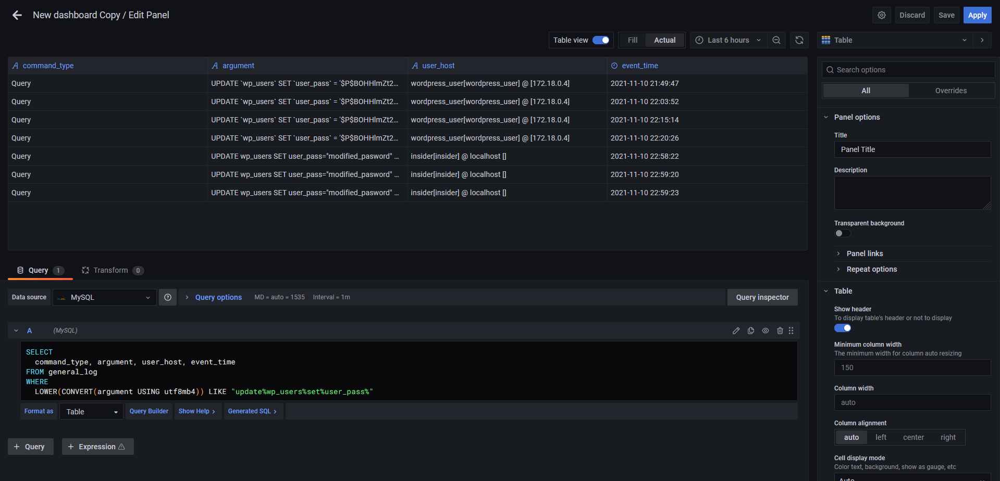

# Heading for Step 4

Now we simulate the insider account who performs different attacks.

1. Login to mysql
We open a new terminal in katacoda. 
Then we go into the `mysql` container:
`docker exec -it mysql bash`{{execute}}
Login to as the insider account:
`mysql -u insider -p`{{execute}}
Type `insider` as password:
`insider`{{execute}}
Execute the following commands to query all users' account information:
`show databases;`{{execute}}
`use wordpress;`{{execute}}
`show tables;`{{execute}}
`select * from wp_users\G`{{execute}}
Execute the following commands to query users' email and password:
`SELECT user_email, user_pass from wp_users;`{{execute}}
Execute the following commands to query change the victim user's password:
`UPDATE wp_users SET user_pass="modified_pasword" where user_login="victimuser";`{{execute}}
We can check the result:
`SELECT user_login, user_pass from wp_users where user_login="victimuser";`{{execute}}

2. check the logs in grafana
We go back to the grafana in port 3000 or by accessing the following link:
https://[[HOST_SUBDOMAIN]]-3000-[[KATACODA_HOST]].environments.katacoda.com

In left panel, choose `Create -> Dashboard`, then choose `add an empty panel`.
Choose `Edit SQL`, `Format as` `Table` in the centre, enable `Table view` at top, choose `Table` as `visualization` in the right upper corner.
Copy the following SQL queries to search if any user viewed the account details:
<pre class="file" data-target="clipboard">
SELECT  
  command_type, argument, user_host, event_time
FROM general_log
WHERE LOWER(CONVERT(argument USING utf8mb4)) LIKE "select%from%wp_users%"
ORDER BY 
  $__timeFilter(event_time) DESC
</pre>
Scroll to the bottom, and we can see the record generated by the `insider` account.

The above SQL query filters the query which select something from the wp_users table, and making the search case-insensitive.
Press `Save` and enter `Panel 1` as dashboard name.

Press `Add panel`, `add an empty panel`.
Choose `Edit SQL`, `Format as` `Table` in the centre, enable `Table view` at top, choose `Table` as `visualization` in the right upper corner.
Copy the following SQL queries to search if any user modified a user's password:
<pre class="file" data-target="clipboard">
SELECT  
  command_type, argument, user_host, event_time
FROM general_log
WHERE
  LOWER(CONVERT(argument USING utf8mb4)) LIKE "update%wp_users%set%user_pass%"
</pre>
Scroll to the bottom, and we can see the record generated by the `insider` account.

The above SQL query filters the query which update (change) the user_pass (password) from the wp_users table, and making the search case-insensitive.
Press `Save`.
