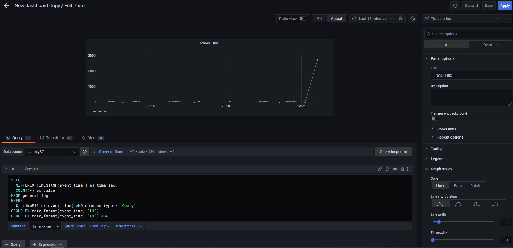
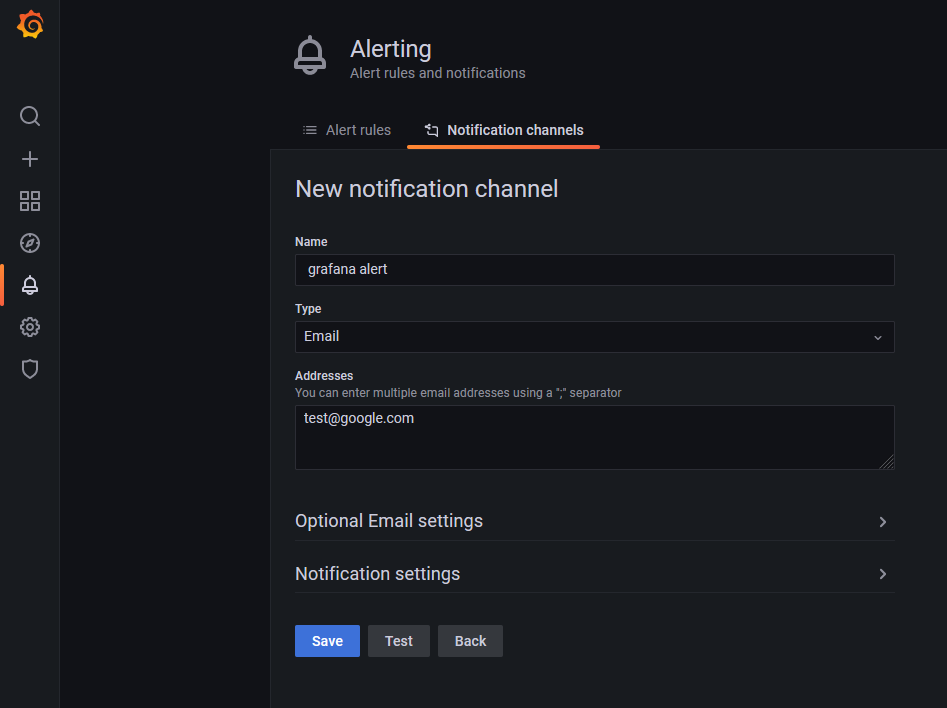
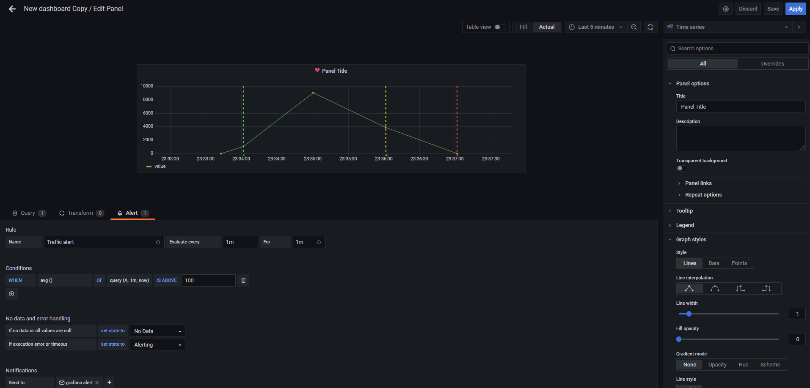

# Heading for Step 5

Monitoring abnormal traffic:

1. Simulate abnormal traffic
We open a new terminal in katacoda. 
Then we create several access:
`curl https://[[HOST_SUBDOMAIN]]-20080-[[KATACODA_HOST]].environments.katacoda.com`{{execute}}

2. Monitoring the abnormal traffic
We go back to the grafana in port 3000 or by accessing the following link:
https://[[HOST_SUBDOMAIN]]-3000-[[KATACODA_HOST]].environments.katacoda.com

Select the `New dashboard Copy`.
Press `Add panel`, `add an empty panel`.
Choose `Edit SQL` in the centre, choose `TimeSeries` as `visualization`, choose `Last 15 minutes` in the right upper corner.
Copy the following SQL queries to see the traffic:
<pre class="file" data-target="clipboard">
SELECT  
  MIN(UNIX_TIMESTAMP(event_time)) as time_sec,
  COUNT(*) as value
FROM general_log
WHERE
  $__timeFilter(event_time) AND command_type = 'Query'
GROUP BY date_format(event_time, '%i')
ORDER BY date_format(event_time, '%i') ASC
</pre>

The above SQL query visualize the traffic of the mysql server.
The `Last 15 minutes` can shows a clear look for the demo.
Press `Save`.

3. Create alert
In the left panel, select `Alerting -> Notification channels`, press `Add Channel`.
Details can be filled in your interest, and press `Save`.

Go back to `New dashboard Copy`.
Edit the traffic panel that we just created.
Choose `Alert` tab, 
evaluate every `1m` for `1m`
when `avg()` of `query(A, 1m, now)` is above `1000`
send to `grafana alert`.

Press `Save`.	

If we create more request by executing: 
`curl https://[[HOST_SUBDOMAIN]]-20080-[[KATACODA_HOST]].environments.katacoda.com`{{execute}}
We can see the result of alert in dotted lines.

