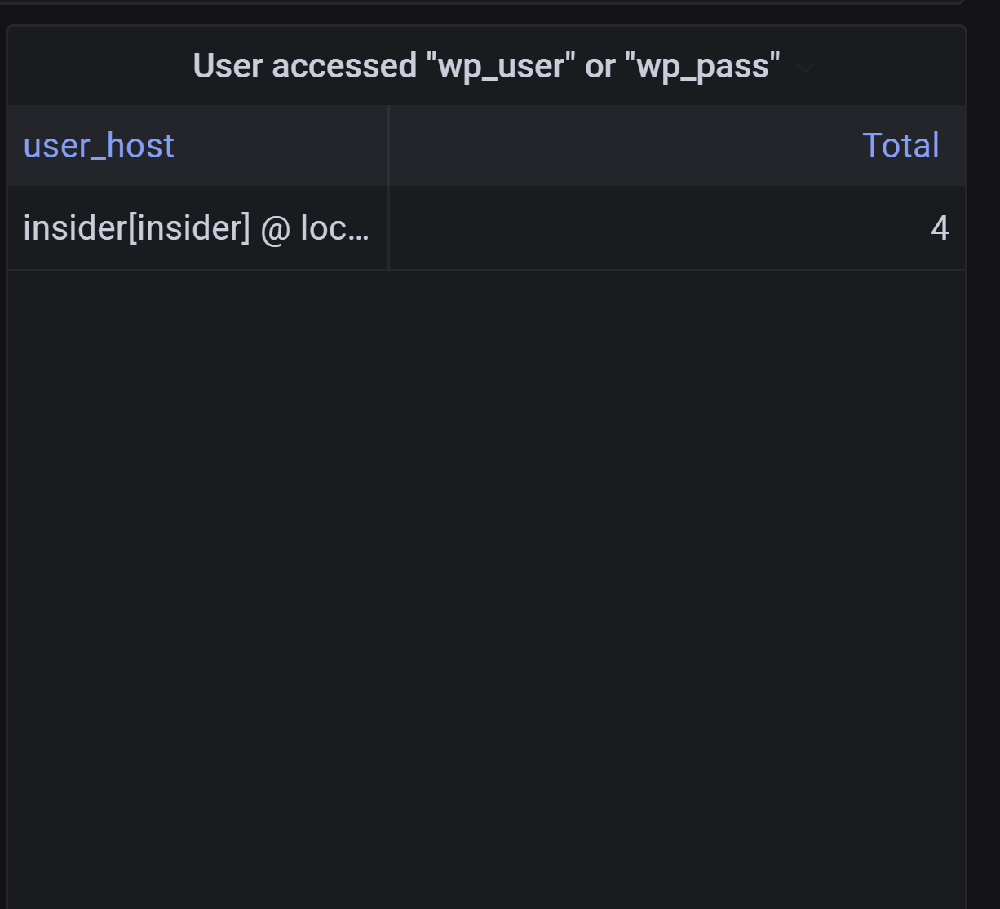

# Show Insider Privilege Threats

Add a new panel with title `User accessed "wp_user" or "wp_pass"`

Choose `Edit SQL` in the centre, choose `Tables` as `visualization`

Copy the following SQL queries to see the user account that query some sensitive tables:
<pre class="file" data-target="clipboard">
SELECT
  user_host,
  COUNT(*) as "Total"
FROM general_log
WHERE
  $__timeFilter(event_time) and 
  (convert(argument, binary) like "%wp_user%" or convert(argument, binary) like "%wp_pass%") and
  (user_host not like "wordpress_user[wordpress_user] @%"
    and user_host not like "grafana[grafana] @%"
    and user_host not like "root[root] @%")
GROUP BY user_host
ORDER BY Total desc
</pre>

## Testing
You now can login to the mysql service using user `insider`

`mysql -u insider -p`{{execute T1}}

with password `insider`

Try to query the `wordpress.wp_user` tables with:
```sql
SELECT * FROM wordpress.wp_user LIMIT 1;
```

