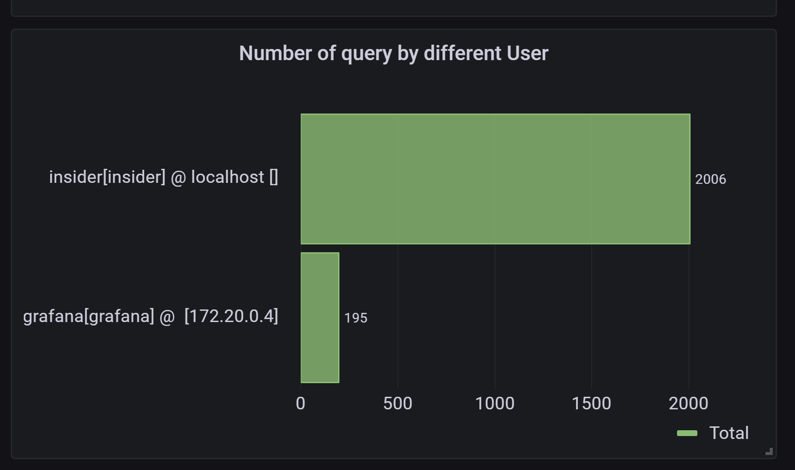

# Show Insider Misuse of Data - Identify

Add a new panel with title `Number of query by different User`

Choose `Edit SQL` in the centre, choose `Bar Chart` as `visualization`, and `Horizontal` for `Orientation`

Copy the following SQL queries to see the number of queries by different users (possible misusing):
<pre class="file" data-target="clipboard">
SELECT
  user_host,
  count(*) as "Total"
FROM general_log
WHERE
  $__timeFilter(event_time) and command_type = "Query"
GROUP BY user_host
ORDER BY Total desc 
</pre>


## Testing
Open a shell in the mysql container: `docker exec -it mysql bash`{{execute T1}}

create a file call `too-many-queries.sh` with the following context: 
```sh
#!/bin/bash

for ((i=0; i<=100; i++))
do
  mysql --user="insider" --password="insider" --execute="SELECT * FROM wordpress.wp_users limit 1;" > /dev/null
done
```

Change the permission of the file to allow execution:
`chmod 777 too-many-queries.sh`

Run the script with:
`./too-many-queries.sh`

