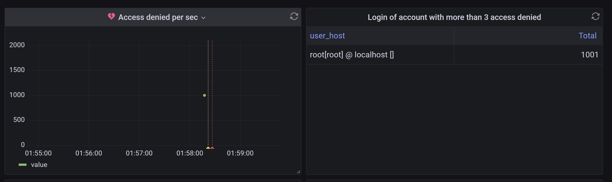

# Brute Force Login

Add a new panel with title `Access denied per sec`

Choose `Edit SQL` in the centre, choose `TimeSeries` as `visualization`

Copy the following SQL queries to see the Access Denied per Second
<pre class="file" data-target="clipboard">
SELECT  
  MIN(UNIX_TIMESTAMP(event_time)) as time_sec,
  COUNT(*) as value
FROM general_log
WHERE
  $__timeFilter(event_time) AND command_type = 'Connect' and convert(argument, binary) like "%Access denied%"
GROUP BY date_format(event_time, '%i')
ORDER BY date_format(event_time, '%i') ASC
</pre>


Add another new panel with title `Login of account with more than 3 access denied`
Choose `Edit SQL` in the centre, choose `Tables` as `visualization`

Copy the following SQL queries to see which user account has invalid login for more than 3 times (possible being hack by others):
<pre class="file" data-target="clipboard">
SELECT
  user_host,
  count(*) as "Total"
FROM general_log
WHERE
  $__timeFilter(event_time) and command_type = "Connect" and convert(argument, binary) like "%Access denied%"
GROUP BY user_host
having Total > 3
ORDER BY Total desc 
</pre>

## Testing
Open a shell in the mysql container:`docker exec -it mysql bash`{{execute T1}}

create a file call `brute-force.sh` with the following context: 
```sh
#!/bin/bash

for ((i=0; i<=1000; i++))
do
  mysql --user="insider" --password="insider" --execute="SELECT * FROM wordpress.wp_users limit 1;"
done
```

Change the permission of the file to allow execution:
`chmod 777 brute-force.sh`

Run the script with:
`./brute-force.sh`

