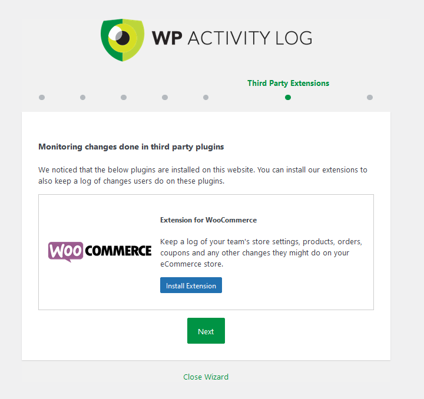

# Heading for Step 6

Additional plugin installation.

1. WP Activity Log plugin installation 
We go back to the wordpress in port 20080 or by accessing the following link:
https://[[HOST_SUBDOMAIN]]-20080-[[KATACODA_HOST]].environments.katacoda.com/wp-admin/index.php
Choose `Plugins -> Add New` from the left panel.
Search `WP Activity Log`, and select `Install Now` and `Activate` after installation.
Then it will be redirected to the WP Activity Log setup page.
Press `Next`, except those specified below:
Choose `Yes, we use other pages to login to WordPress. ` in Step 3.

Choose `Yes` in `Can visitors register as a user on your website?` in Step 4.

Choose `Install Extension` in `Extension for WooCommerce` in Step 6.

Now if you visit any post/website, the WP Activity Log will record it.
Like visiting:
https://[[HOST_SUBDOMAIN]]-20080-[[KATACODA_HOST]].environments.katacoda.com/?product=hoodie-with-logo
Then go back to left panel, `WP Activity Log -> Log viewer`
